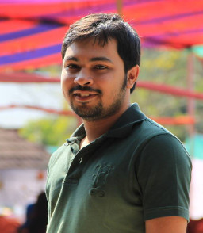

This is the personal website of Turja Kundu,I am currently working with ASA-International, a leading Micro Finance Banking Organization.i have completed B.Sc in Computer Science and Engineering in 2012, from BUET.  

I would like to introduce myself as a highly motivated & dedicated professional with 8 years of progressive experience within Software Industry. During the tenure of my career I’ve worked in 
various platforms including enterprise level software development, mobile application development, database management, and as well as web application development. 

[curriculum vitae ]({{ BASE_PATH }}/assets/turja_cv.pdf)

---

<h4>contact</h4>

    

        

            Turja Kundu 
            1 No Road 
            Shyamoli, Dhaka 
            Bangladesh  

            

            Email: <code>turja</code><b></b><code>16</code><b>don't</b><code>@</code><b>want</b><code>g</code><b>spam!
            </b><code>ma</code><b>So</b><code>.</code><b>please</b><code>i</code><b>leave
            </b><code>l</code><b>me</b><code>.c</code><b>alone</b><code>o</code><b>!</b><code>m</code> 
            Phone: 8801717210862
            

        

        

        
        

    

